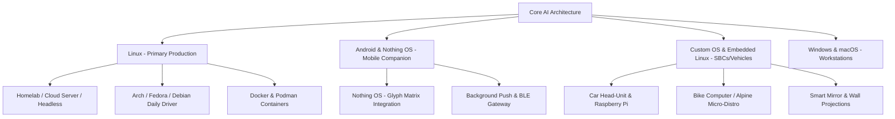

# 🌐 Core AI — Sovereign Personal Companion & Ubiquitous Life OS

> **A self-hosted, sovereign, and privacy-first AI companion built to integrate into daily life across your house, grounds, car, bike, smart glasses, smart mirror, and phone. No big-tech cloud lock-in, zero hardcoded assumptions, and designed for multi-year evolution.**

---

## 📖 Table of Contents
1. [The Vision](#-the-vision)
2. [Repository Structure](#-repository-structure)
3. [Core Philosophy & Architecture](#-core-philosophy--architecture)
4. [Subsystem Deep Dive](#-subsystem-deep-dive)
   - [Tool Introspection & Registry](#1-tool-introspection--registry)
   - [Autonomous DAG Pipeline Engine](#2-autonomous-dag-pipeline-engine)
   - [Self-Extension & Dynamic Tool Synthesis](#3-self-extension--dynamic-tool-synthesis)
   - [Jarvis-Like Failure Awareness](#4-jarvis-like-failure-awareness)
   - [Multi-Sink Logging & Audit Trails](#5-multi-sink-logging--audit-trails)
5. [Ubiquitous Device & Zone Ecosystem](#-ubiquitous-device--zone-ecosystem)
6. [Multi-Platform & Operating System Strategy](#-multi-platform--operating-system-strategy)
7. [Current Status: What Works vs. Roadmap](#-current-status-what-works-vs-roadmap)
8. [Problem Logging & Technical Debt Ledger](#-problem-logging--technical-debt-ledger)
9. [Getting Started & Quickstart](#-getting-started--quickstart)


---

## 🌟 The Vision

Core AI is not a simple chatbot or smart-speaker gimmick. It is designed as an **autonomous life assistant** that:
- **Operates Ubiquitously**: Seamlessly transitions between your living room, garden/workshop, car, bicycle, smart glasses, smart mirror, and smartphone.
- **Solves Problems Autonomously**: Analyzes goals against its current toolset, constructs multi-step execution pipelines (DAGs), and works until tasks are complete.
- **Thinks & Executes Concurrently**: Runs independent tasks and tool calls in parallel ("multiple things at once").
- **Builds Its Own Tools**: Detects missing capabilities, generates validated code, tests it in a sandbox, persists it to disk, and hot-loads it into the active runtime.
- **Proactive & Aware**: Knows when something fails, diagnoses why, self-heals, and proactively assists (e.g. calling you while riding to work: *"You forgot to close the garage door, but don't worry, I locked it for you"*).
- **100% Sovereign**: Runs on your own hardware via local models (Ollama, local STT/TTS) or encrypted private networks (Tailscale/WireGuard), completely independent of big-tech subscriptions or surveillance capitalism.

---

## 📂 Repository Structure

```text
Core AI/
├── brain/                      # Intelligence, Planning & Execution
│   ├── dynamic_generator.py    # Synthesizes, verifies (AST + sandbox), & persists new tools
│   ├── pipeline_engine.py      # Async DAG engine; concurrent step execution & variable resolution
│   ├── planner.py              # Tool introspection, capability gap detector & DAG architect
│   └── safety.py               # Human-in-the-loop validation for critical hardware actions
├── config/                     # Configuration & Environment
│   ├── nodes.yaml              # Multi-device topology (rooms, outdoor, car, bike, glasses, phone)
│   ├── settings.yaml           # Model endpoints, logging paths, audio & bus settings
│   └── .env.example            # API keys and local endpoint credentials template
├── core/                       # Foundational Microkernel Services
│   ├── bus.py                  # Protocol-agnostic EventBus (Redis with auto in-memory fallback)
│   ├── context.py              # Ubiquitous ContextManager (spatial zones, device profiles)
│   ├── logging_setup.py        # Multi-sink logger: Console, Rotating File, & JSONL audit
│   ├── schemas.py              # Pydantic schemas (events, pipelines, dynamic tools, diagnosis)
│   └── state.py                # SQLite WAL-mode state manager (pipelines, steps, audit logs)
├── docs/                       # Project Documentation & Issue Tracking
│   └── PROBLEMS_AND_DEBT.md    # Dedicated ledger tracking known bugs, edge cases & debt
├── engines/                    # Audio Processing Engines
│   ├── voice_in.py             # Silero-VAD + faster-whisper STT audio capture
│   └── voice_out.py            # Text-To-Speech engine (Kokoro / Piper / Pyttsx3)
├── interfaces/                 # Client Interfaces & Test Harnesses
│   └── cli/
│       ├── problem_solver_cli.py # Interactive CLI demo: concurrency, dynamic tools, awareness
│       └── voice_test.py         # Voice pipeline interactive test harness
├── logs/                       # System & Audit Logs
│   ├── core_ai.log             # Rotating system logs (5MB, 5 backups)
│   └── pipelines.jsonl         # Detailed JSONL audit records of all pipeline runs
├── tools/                      # Tool Ecosystem
│   ├── dynamic/                # Self-generated tools written, verified, and saved by Core AI
│   │   └── hash_string.py      # Example auto-synthesized dynamic tool
│   ├── native/                 # Built-in native tools
│   │   ├── file_tools.py       # File reading, writing, and directory listing
│   │   ├── home_assistant.py   # Home Assistant smart device integration mock
│   │   ├── math_tools.py       # Safe mathematical evaluation & statistics
│   │   └── system_tools.py     # System time and platform status
│   └── registry.py             # Dynamic tool registry, catalog introspection, & safe execution
├── tests/                      # Automated Test Suite (pytest)
│   ├── test_bus.py             # EventBus pub/sub and in-memory queue tests
│   ├── test_dynamic_generator.py # AST security validation & sandbox execution tests
│   ├── test_logging.py         # JSONL pipeline audit and logger tests
│   ├── test_pipeline_engine.py # DAG concurrency, variable piping, and retry tests
│   ├── test_planner.py         # Introspection, gap detection, and model availability tests
│   ├── test_registry.py        # Tool discovery, catalog schemas, and execution timing tests
│   └── test_voice_pipeline.py  # Voice input initialization tests
├── core_ai.db                  # SQLite database (pipelines, steps, dynamic tools, audit logs)
├── requirements.txt            # Python dependencies
└── main.py                     # Core AI microkernel runtime entrypoint
```

---

## 🏛️ Core Philosophy & Architecture

### 1. Zero Hardcoding: Spatial Topology Over "Rooms"
Hardcoding assumptions like `"everything is a room"` breaks when scaling to a car, bike, garden, or smart glasses. Core AI structures physical reality into **`SpatialContext`** and **Hierarchical Zones**:
- `home/indoor/<room>` — living room, office, bedroom, kitchen.
- `home/outdoor/<area>` — garden, patio, driveway, workshop/garage.
- `mobile/vehicle/<type>` — car (OBD-II, head-unit), bike (bike computer, GPS).
- `mobile/wearable/<type>` — smart glasses (AR HUD, camera FOV), phone (push, rich screen).

Every event (`BaseEvent`) carries its `spatial_context`, `device_type`, and `capabilities`, enabling the system to understand *where* the user is and *how* to interact.

### 2. Protocol-Agnostic Event Mesh
Devices connect across different physical media:
- **Local LAN**: High-bandwidth room speakers, smart mirrors, home servers.
- **WireGuard / Tailscale Mesh**: Secure private encrypted WAN connecting your car and phone back to the home core.
- **BLE (Bluetooth Low Energy)**: Battery-constrained smart glasses and bike computers connecting through the smartphone.
The `EventBus` abstracts message passing with automatic in-memory fallback, allowing transparent transport swapping without altering tool or brain logic.

### 3. Distributed Edge Tool Dispatch
Tools aren't restricted to the central server. Through `ToolCallRequest.target_node`, tools can run:
- **Locally on Server**: Heavy computation, database lookups, file operations.
- **On Phone**: Sending SMS, checking mobile contacts, vibration patterns.
- **On Car**: Remote cabin preheating, door locks, querying battery/fuel telemetry.
- **On Glasses**: Displaying HUD glance cards, capturing field-of-view images.

---

## ⚙️ Subsystem Deep Dive

### 1. Tool Introspection & Registry
- **Location**: `tools/registry.py`
- Maintains both native built-in tools and self-synthesized dynamic tools.
- Exposes `get_tool_catalog()`, which provides rich schemas, descriptions, and parameter specifications formatted for LLM reasoning.
- Automatically scans `tools/dynamic/` on startup and supports runtime hot-reloading (`reload_dynamic_tools()`).
- Returns structured `StepResult` objects containing exact execution timing (`duration_ms`), success flags, return values, and full exception tracebacks.

### 2. Autonomous DAG Pipeline Engine
- **Location**: `brain/pipeline_engine.py`
- Given a `PipelinePlan`, parses dependencies between steps.
- **Concurrency ("Multiple things at once")**: Detects all steps whose dependencies are satisfied and executes them in parallel via `asyncio.gather` and thread worker pools.
- **Dynamic Variable Piping**: Steps dynamically reference outputs from prior steps using syntax like `{{steps.math_step.output.result}}` or `$step_id.field`.
- Manages state persistence at every step transition in SQLite (`core_ai.db`).

### 3. Self-Extension & Dynamic Tool Synthesis
- **Location**: `brain/dynamic_generator.py`
- When the planner determines a needed tool is missing:
  1. **Code Generation**: Generates Python implementation conforming to schema rules.
  2. **Security Gate (AST Validation)**: Parses the AST to strictly disallow dangerous packages (`subprocess`, `shutil`, `ctypes`, etc.) and unsafe calls (`fork`, `eval`, `exec`).
  3. **Sandbox Verification**: Executes the generated tool in an isolated dictionary namespace with sample arguments.
  4. **Persistence & Hot-Reload**: Persists the tool to `tools/dynamic/<tool_name>.py`, saves metadata to the DB, and immediately registers it into `ToolRegistry` without restarting the server!

### 4. Jarvis-Like Failure Awareness
- **Location**: `brain/pipeline_engine.py` & `brain/planner.py`
- When a tool returns an error status or raises an exception:
  - Captures a structured `FailureDiagnosis` (failed step, tool name, error message, root-cause analysis, and suggested remediation).
  - Distinguishes between retryable errors (missing arguments, transient network glitches) and fatal errors (missing files, unregistered tools).
  - Logs warnings with full diagnostic context and triggers self-healing retries with backoff or re-planning.

### 5. Multi-Sink Logging & Audit Trails
- **Location**: `core/logging_setup.py`
- **Colored Console**: Clean, colorized logs with timestamps, levels, and contextual tags.
- **Rotating System Log**: `logs/core_ai.log` captures all system events with automatic 5MB rotation and 5 backups.
- **JSONL Audit Trail**: `logs/pipelines.jsonl` provides an immutable, machine-readable chronological log of every pipeline lifecycle transition.
- **Database Logs**: Full audit records persisted to the `execution_logs` table in `core_ai.db`.

---

## 📡 Ubiquitous Device & Zone Ecosystem

Defined in `config/nodes.yaml`:

| Node ID | Zone | Type | Primary Capabilities | Transport |
|---|---|---|---|---|
| `room_office` | `home/indoor/office` | `room` | Mic, Speaker, Screen | Local LAN |
| `room_living` | `home/indoor/living_room` | `room` | Mic, Speaker, TV Screen | Local LAN |
| `ground_garden` | `home/outdoor/garden` | `outdoor_zone` | Outdoor Speaker, Ambient Mic, Sensors | Local LAN |
| `ground_workshop` | `home/outdoor/workshop` | `outdoor_zone` | Mic, Speaker, Industrial Tools | Local LAN |
| `vehicle_car` | `mobile/vehicle/car` | `vehicle_car` | Car Audio, Dashboard HUD Tile, GPS, OBD-II | Tailscale Mesh |
| `vehicle_bike` | `mobile/vehicle/bike` | `vehicle_bike` | High-Contrast HUD, Cadence, GPS, Haptic | BLE / Phone Bridge |
| `wearable_glasses`| `mobile/wearable/glasses`| `smart_glasses`| Micro HUD, Bone Conduction Audio, FOV Cam | BLE / Phone Bridge |
| `wearable_phone` | `mobile/wearable/phone` | `phone` | Rich Screen, Push Notifications, GPS, Mic | Cellular |

---

## 🐧 Multi-Platform & Operating System Strategy

Core AI is designed with **strict platform neutrality and zero Windows-lock-in**. The system operates across a diverse spectrum of operating systems:



### 1. Linux (Primary Production & Daily-Driver Target)
- **Role**: The core production environment for home servers, automotive SBCs, and primary personal workstations.
- **Supported Distros**: Arch, Debian, Ubuntu, Fedora, Alpine.
- **Audio Stack**: Seamless integration with PipeWire, PulseAudio, and native ALSA drivers.
- **Process Management**: Native `systemd` user units and headless background daemons.

### 2. Android & Nothing OS (Tier-1 Mobile Companion)
- **Role**: Ubiquitous companion bridge while moving outside the home.
- **Nothing OS Specialization**:
  - **Glyph Matrix Integration**: Uses the rear Glyph LED interface for subtle ambient feedback (e.g. pulsing glyph patterns when Core AI is thinking, executing an action, or alerting you quietly without turning on the screen).
  - **Ambient Widgets & Quick Tiles**: Fast 1-tap voice invocation and status display.
- **Edge Gateway**: The phone routes cellular traffic and bridges Bluetooth Low Energy (BLE) peripherals (smart glasses, bike sensors) back to Core AI.

### 3. Custom OS & Embedded Linux (Automotive, Bike, Smart Mirror, Projections)
- **Role**: Dedicated appliance controllers.
- **Targets**:
  - **Smart Mirror & Wall Projections**: Lightweight micro-browsers (Chromium kiosk / WebGL / Canvas) rendering ambient `AdaptiveResponseEvent` HUD cards.
  - **Vehicle (Car & Bike)**: Minimalist Alpine/Yocto/Buildroot Linux builds running on ARM/x86 SBCs with direct CAN-bus/OBD-II and GPS access.

### 4. Windows (Transitionary Development)
- **Role**: Current active development environment.
- **Guarantees**: Zero Win32-locked dependencies, cross-platform UTF-8 console encoding, standard POSIX-compliant Python library usage.

### 5. Turnkey Containerization (Docker & Podman)
Deploy Core AI on any Linux server, unRAID, TrueNAS, or homelab in a single command:
```bash
docker compose up -d
```
All persistent databases (`core_ai.db`), configuration files (`config/`), dynamically synthesized tools (`tools/dynamic/`), and logs (`logs/`) mount to host volumes.

---

## 📊 Current Status: What Works vs. Roadmap


| Feature / Capability | Status | Notes |
|---|---|---|
| **Tool Introspection & Discovery** | ✅ Working | Registry scans native + dynamic tools; provides full catalog schemas |
| **Multi-Step DAG Pipeline Planner** | ✅ Working | Heuristic and LLM decomposition with dependency graph |
| **Concurrent Step Execution** | ✅ Working | Independent steps run in parallel via `asyncio.gather` |
| **Dynamic Variable Piping** | ✅ Working | `{{steps.<id>.output.<field>}}` resolved recursively at runtime |
| **Dynamic Tool Synthesis & Sandbox** | ✅ Working | AST security gate + isolated sandbox + disk save + runtime reload |
| **Jarvis-Like Failure Awareness** | ✅ Working | Diagnoses root cause, provides fixes, handles retries |
| **Multi-Sink Logging** | ✅ Working | Console + `core_ai.log` + `pipelines.jsonl` + SQLite `execution_logs` |
| **In-Memory Bus Fallback** | ✅ Working | Zero-setup testing without requiring running Redis container |
| **Fast Model Health Checking** | ✅ Working | Socket/env pre-checks avoid long timeouts on offline LLMs |
| **Automated Test Suite** | ✅ Working | 13/13 unit and integration tests passing (`pytest tests`) |
| **Smart Mirror & Wall Projection UI** | 🔄 Planned | Web/Canvas frontends rendering `AdaptiveResponseEvent` HUD cards |
| **Proactive Agent Watcher Loop** | 🔄 Planned | Autonomous background daemon detecting conditions and triggering calls |
| **Edge Node Network Transport** | 🔄 Planned | WebSocket / Tailscale proxy for remote tool execution on car/glasses |
| **Long-Term Vector Memory** | 🔄 Planned | `sqlite-vec` or local embeddings for associative personal memory |

---

## 📝 Problem Logging & Technical Debt Ledger

To ensure issues and edge-cases are **never lost** over this multi-year project, all bugs, limitations, and architectural debts are logged in:

👉 **[docs/PROBLEMS_AND_DEBT.md](file:///g:/VSC_Projects/Core%20AI/docs/PROBLEMS_AND_DEBT.md)**

Whenever you discover a bug or limitation, record:
1. Issue ID & Component.
2. Symptom & Stacktrace.
3. Root Cause Analysis.
4. Resolution or Planned Architectural Fix.
5. Status Tag (`[OPEN]`, `[RESOLVED]`, `[WATCHLIST]`).

---

## 🚀 Getting Started & Quickstart

### Prerequisites
- Python 3.10+ (Tested on Python 3.13)
- Windows / Linux / macOS

### 1. Installation
Activate your virtual environment and install dependencies:
```bash
# Windows
.venv\Scripts\activate
pip install -r requirements.txt
pip install pytest
```

### 2. First-Run Setup (Zero Hardcoding)
Configure your local operator profile, preferred name, aliases, and initial primary space:
```bash
python interfaces/cli/setup_wizard.py
```

### 3. Running Automated Tests
Run the complete unit and integration test suite:
```bash
python -m pytest tests
```
*Expected output: `24 passed in ~29s`.*

### 4. Interactive Operator Core Console (CLI Shell)
Launch the rich interactive operator command center:
```bash
python interfaces/cli/core_console.py
```
- Solve arbitrary goals with real-time DAG pipeline visualization (`solve <goal>`).
- Inspect and manage spatial zones dynamically (`zones`, `zone add <id> [name]`).
- Inspect connected devices and security tiers (`devices`).
- View and update operator profile (`profile`, `profile set <name>`).
- Dispatch live HUD cards to ambient mirrors or wall projections (`hud <title> | <body>`).
- Stream structured execution and audit logs (`logs [count]`).

### 5. Starting the Universal Core AI Gateway & Microkernel
Launch the microkernel, proactive reasoning daemon, and high-speed API gateway:
```bash
python main.py
```
- **Interactive Swagger REST Docs**: [http://localhost:8000/docs](http://localhost:8000/docs)
- **Interactive Master Roadmap Visualizer**: [http://localhost:8000/roadmap](http://localhost:8000/roadmap)
- **Ambient Smart Mirror & Wall Projection HUD**: [http://localhost:8000/mirror](http://localhost:8000/mirror)
- **Real-Time Event WebSocket**: `ws://localhost:8000/ws/events`
- **Real-Time Log Stream WebSocket**: `ws://localhost:8000/ws/logs`


### 6. Zero-Friction Device Onboarding (1-Line Plug & Play)
When you turn on a new laptop, Raspberry Pi, Arduino serial bridge, or Linux SBC, onboard it instantly with:
```bash
python -m interfaces.install.enroll --server http://<core-ip>:8000 --device-name "Laptop-01" --device-type laptop --zone "workspace" --secret core_sovereign_secret
```
This registers the device in SQLite, obtains a secure session token, and connects it to the Core AI mesh.

### 7. Security Tiers & Privacy Protection (Owner vs. Ambient vs. Guest)
Core AI strictly defends personal privacy and enforces three distinct trust tiers:
- **Host / Owner (`OWNER`)**: Full access to personal identity memory, sensitive files, private tools, and all spatial zones.
- **Ambient Displays & Sensors (`AMBIENT`)**: Smart mirrors, wall projectors, room microphones. Can render HUD cards, play audio, and report environmental sensor data, but cannot dump private personal data.
- **Guest Devices (`GUEST`)**: Untrusted devices on the local network (e.g. a friend's phone on WiFi, guest laptop). Personal profile access and critical tools are rejected (`HTTP 403 Forbidden`). Interaction requires explicit owner approval.

### 8. Year-End 2026 Milestone: Multi-Zone Workspace & Living Sanctuary Unified
By the end of 2026, Core AI serves as an active, seamless, overwatching harness connecting the operator's primary workspace/studio and personal living sanctuary:
- Eliminates manual back-and-forth management between spaces.
- Dynamically creates and tracks zones on-demand without hardcoded room assumptions.
- Proactively handles peripheral states, audio interfaces, lighting profiles, and reminders.

### 9. Anti-Slop & Truthful Capability Standard
Core AI strictly adheres to the Truthful Capability Principle:
- Zero hallucinations or false promises of capabilities it does not possess.
- If an action or tool is unavailable, Core AI diagnoses the exact root cause, reports it transparently, and optionally synthesizes or requests the needed tool.


