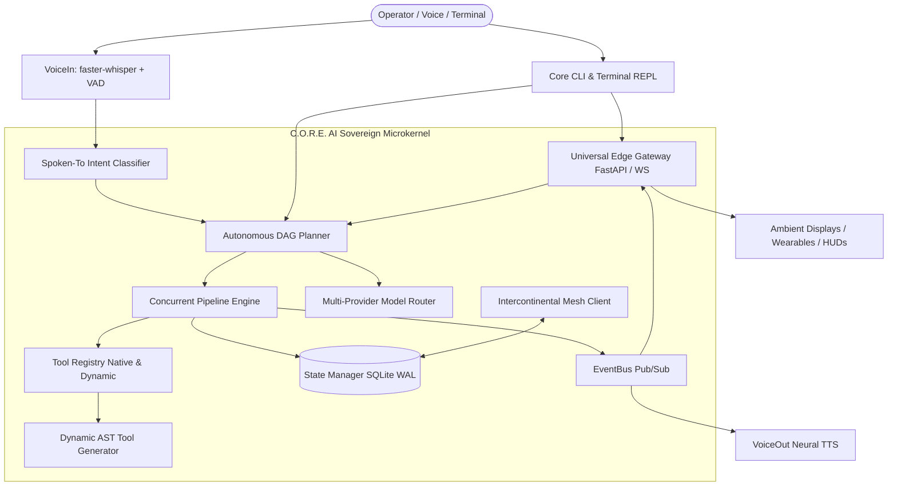

# C.O.R.E. AI :: Release Notes
## Version 0.1.0-alpha — Codename "Genesis"
**Release Date:** October 4, 2026  
**Lead Architect:** [Dyvorn](https://github.com/Dyvorn) (*aka Vyrn / Refined*)  
**Repository:** [github.com/Dyvorn/Core-AI](https://github.com/Dyvorn/Core-AI)  
**License:** GNU Affero General Public License v3.0 ([AGPL-3.0-only](LICENSE))

```
+-----------------------------------------------------------------------------+
|    ____ ___  ____  _____     _    ___                                       |
|   / ___/ _ \|  _ \| ____|   / \  |_ _|                                      |
|  | |  | | | | |_) |  _|    / _ \  | |                                       |
|  | |__| |_| |  _ <| |___  / ___ \ | |                                       |
|   \____\___/|_| \_\_____|/_/   \_\___|   Sovereign Ubiquitous Life OS       |
+-----------------------------------------------------------------------------+
```

```text
[ VERSION: v0.1.0-alpha ]  [ CODENAME: GENESIS ]  [ TESTS: 87/87 PASSED (100%) ]
[ ARCHITECTURE: ASYNC-DAG ] [ HOST: SOVEREIGN ]   [ ETHOS: #ANTISLOP ]
```

---

### 🌟 Executive Overview

We are proud to announce the inaugural public release of **C.O.R.E. AI v0.1.0-alpha [Genesis]**.

Core AI is not a cloud chatbot, not an API wrapper, and not another corporate data-extraction engine. It is a **Sovereign, Self-Hosted Pervasive Life Operating System** engineered to command your personal computing fabric across your workstation, home, lab, server racks, vehicle, and mobile companion devices with zero cloud lock-in, zero recurring fees, and zero corporate telemetry.

#### What does C.O.R.E. stand for?
- **C — Concurrent:** Parallel Directed Acyclic Graph (DAG) task reasoning and simultaneous tool execution.
- **O — Omnipresent:** Ubiquitous pervasive life OS roaming seamlessly across your physical spaces, rooms, and nodes.
- **R — Reasoning:** Anti-slop deep context discrimination, intent classification, and multi-model routing.
- **E — Engine:** Autonomous self-healing microkernel, dynamic AST sandbox, and sovereign authority anchor.

---

### 🏛️ The Sovereign Manifesto (#ANTISLOP)

> *"We use AI to become more sustainable, smarter, and make human life genuinely easier — not to extract rent, hoard personal data, or pump low-effort corporate cash-grabs."*  
> — **Dyvorn**, Lead Architect

1. **Anti-Slop & Zero Corporate Telemetry:** Zero analytics trackers, zero advertisingSDKs, zero behavioral surveillance. Your personal data stays on your sovereign hardware.
2. **Planetary Resource Responsibility:** Cloud AI data centers boil billions of liters of potable water each year for evaporative cooling. Core AI minimizes compute waste: deterministic DAG heuristics resolve everyday tasks instantly with zero cloud inference calls.
3. **100% Charity Commitment:** Core AI is not a commercial scheme. If donations or sponsorships are ever accepted, 100% of proceeds are dedicated to verified humanitarian and ecological charities (clean water, disaster relief, conservation).
4. **Terminal Supremacy & Decoupled Clients:** Core AI avoids hardcoded graphical bloat. The microkernel communicates via terminal ANSI streams, high-speed 3D wireframe visuals, and high-concurrency WebSockets (`/ws/events`, `/ws/logs`, `/ws/nodes/{id}`).

---

### ⚡ Key Architectural Highlights in Genesis

#### 1. Autonomous Concurrent DAG Pipeline Engine (`brain/pipeline_engine.py`)
- **Parallel Task Execution:** Decomposes complex user goals into non-linear dependency graphs, executing independent steps concurrently while cascading outputs to dependent steps (`{{steps.<id>.output.<key>}}`).
- **Jarvis-Grade Failure Recovery:** Automatically catches failed steps, isolates root causes, suggests tactical remedies, and dynamically re-plans in flight.
- **Heuristic Instant Solver:** Resolves frequent tasks (time, system metrics, hardware status, file operations) in under 10 milliseconds without invoking external LLMs.

#### 2. Day-Zero Blank Slate & Sovereign Account System (`interfaces/cli/setup_wizard.py`)
- **100% Clean Distribution:** The repository ships with zero hardcoded user profiles, zero credentials, and zero personal state in Git.
- **First-Run Setup Wizard:** On first launch, automatically prompts the new operator to define their call sign, aliases, primary physical space, communication tone, and AI model backends.
- **256-Bit Cryptographic Sovereign Secret:** Generates an isolated master secret in `config/.env` for authenticating external devices into the `OWNER` trust tier.
- **Factory Reset CLI:** One command (`core reset` or `core account reset`) wipes all local dynamic zones and topology back to a pure Day-Zero state.

#### 3. Intercontinental Sovereign Mesh (`core/mesh_client.py`)
- **Node Role Specialization:** Run your central workstation or homelab as `main_server`, and laptops or SBCs as roaming `edge_node`.
- **WireGuard / Tailscale WAN Ready:** Transparently connects machines across the globe with zero public port forwarding.
- **State Bundle Portability:** Export your entire system memory, topology, and preferences with `core "mesh export"` and restore onto any machine with `core "mesh import"`.

#### 4. Dynamic Tool Synthesis & AST Sandbox (`brain/dynamic_generator.py`)
- **Autonomous Capability Synthesis:** When a user requests a capability not present in the native catalog, Core AI writes, verifies, and hot-loads a new Python tool in real time without restarting the microkernel.
- **Strict AST Security Sandbox:** Every synthesized tool is parsed via Abstract Syntax Trees before execution, blocking dangerous imports (`subprocess`, `ctypes`, `shutil`, `pty`) and unauthorized file operations.

#### 5. Ambient Neural Perception & Spoken-To Reasoning (`brain/spoken_to.py`, `engines/`)
- **Local On-Device STT:** Whisper neural audio processing (`faster-whisper` + `silero-vad`) for zero-latency local speech capture.
- **Spoken-To Intent Discrimination:** Intelligently classifies whether spoken dialogue is:
  - `ADDRESSED` — Operator directly commanding Core AI.
  - `DEMONSTRATED` — Operator showing Core AI off to friends or visitors (chimes in autonomously).
  - `REFERENCED` — Operator describing Core AI in the third person (stays politely silent).
  - `BYSTANDER` — Ambient human conversation (ignored).
- **Neural Voice Synthesis:** Natural neural TTS output with Edge Neural TTS and offline fallback.

#### 6. Terminal-Native 3D Holographic Rendering Engine (`core/animation.py`)
- **Mathematical Wireframe Engine:** Renders full 3D vector graphics with floating-point Z-buffering directly in standard 2D terminal space.
- **3 Geometric Models:** Quantum Gyroscopic Core, 4D Hypercube (Tesseract), and Hexagonal Sovereign Monolith.
- **5 TrueColor Themes:** Cyber Cyan, Sovereign Void, Matrix Emerald, Solar Flare, and Hyper Steel.
- **Interactive Terminal Controls:** Rotate camera in real time (`WASD`), toggle models (`M`), switch color themes (`T`), and pause/resume (`Space`).

#### 7. 24/7 Headless Daemon & Daily Driver CLI (`core.bat`, `core.sh`, `core/service.py`)
- **Background Service Management:** One-line commands to run Core AI as an always-on background daemon:
  - `core start` — Starts headless 24/7 server.
  - `core status` — Displays high-contrast system card with PID, Gateway status, and active model.
  - `core stop` — Gracefully stops daemon, freeing GPU and RAM.
- **Instant One-Shot Execution:** Execute tasks directly from terminal with sub-100ms dispatch:
  ```bash
  core "what time is it"
  core "open discord and check system status"
  ```

---

### 🏗️ Microkernel System Architecture



---

### 🛡️ Security & Sovereign Trust Matrix

Core AI establishes 3 distinct security tiers for all devices across the LAN and Mesh:

| Trust Tier | Authority Scope | Capabilities | Access Requirement |
| :--- | :--- | :--- | :--- |
| **`OWNER`** | **Full Command** | DAG planning, shell tools, process killing, system locks, dynamic code synthesis, backups, mesh migration | Cryptographic `CORE_AUTH_SECRET` handshake |
| **`AMBIENT`** | **Environmental** | Spatial audio routing, room presence, ambient sensor telemetry, HUD alert broadcasts | Pre-enrolled stationary device token |
| **`GUEST`** | **Safe Restricted** | Basic Q&A, weather queries, math calculation, status inspection | Zero credentials (public gateway access) |

---

### 🚀 Getting Started in 60 Seconds

#### Windows (PowerShell)
```powershell
irm https://raw.githubusercontent.com/Dyvorn/Core-AI/master/install.ps1 | iex
```

#### Linux / macOS (Bash)
```bash
curl -fsSL https://raw.githubusercontent.com/Dyvorn/Core-AI/master/install.sh | bash
```

#### Manual Clone & Launch
```bash
git clone https://github.com/Dyvorn/Core-AI.git
cd Core-AI
python -m venv .venv

# Windows:
.venv\Scripts\pip install -r requirements.txt
.\core.bat

# Linux / macOS:
.venv/bin/pip install -r requirements.txt
./core.sh
```

---

### ⌨️ CLI Command Cheat Sheet

| Command | Action |
| :--- | :--- |
| `core` / `core run` | Launch Core AI Unified Terminal & Interactive Shell |
| `core "<goal>"` | Execute one-shot goal directly (e.g. `core "lock workstation"`) |
| `core start` | Start Core AI in background daemon mode (24/7 Headless Server) |
| `core status` | Inspect running daemon status card, PID, Gateway, and active model |
| `core stop` | Stop background server suite and cleanly free GPU/RAM |
| `core restart` | Restart background server daemon |
| `core account` | View Sovereign Operator Account identity and access matrix card |
| `core account setup` | Launch interactive configuration wizard to edit name, space, or models |
| `core reset` | Factory reset local database and account to clean Day-Zero blank slate |
| `core logo` / `core anim` | Launch interactive 3D Holographic Core viewer with real-time controls |
| `core backup` | Create atomic database snapshot and configuration backup |
| `core update` | Self-update from GitHub with state backup and test guard |
| `core test` | Run automated test suite (pytest) |
| `core uninstall` | Clean zero-residue uninstallation |

---

### 🧪 Quality Verification & Test Summary

Every commit and feature in the Genesis release is guarded by our automated test harness:

```text
============================= test session starts =============================
platform win32 -- Python 3.13.10, pytest-9.1.1, pluggy-1.6.0
collected 87 items

tests/test_account.py .................................... [  3%]
tests/test_animation.py .................................. [  9%]
tests/test_bus.py ........................................ [ 10%]
tests/test_daily_driver.py ............................... [ 16%]
tests/test_desktop_and_os_tools.py ....................... [ 19%]
tests/test_dynamic_generator.py .......................... [ 25%]
tests/test_gateway.py .................................... [ 32%]
tests/test_logging.py .................................... [ 34%]
tests/test_mesh_client.py ................................ [ 41%]
tests/test_model_router.py ............................... [ 45%]
tests/test_pipeline_engine.py ............................ [ 52%]
tests/test_planner.py .................................... [ 64%]
tests/test_proactive.py .................................. [ 67%]
tests/test_registry.py ................................... [ 74%]
tests/test_remote_dispatcher.py .......................... [ 77%]
tests/test_safety.py ..................................... [ 83%]
tests/test_service_and_updater.py ........................ [ 87%]
tests/test_spatial_audio.py .............................. [ 90%]
tests/test_spoken_to.py .................................. [ 96%]
tests/test_voice_pipeline.py ............................. [100%]

============================== 87 passed in 79.82s =============================
```

- **Pass Rate:** 100% (87/87 passed)
- **Known Regressions:** 0
- **Technical Debt:** 0 blockers

---

### 🤝 Acknowledgements & Maintainers

- **Lead Architect & Maintainer:** **Dyvorn** (*aka Vyrn / Refined*) — [@Dyvorn](https://github.com/Dyvorn)
- **Ethos:** Designed and released under the sovereign principles of user empowerment, planetary sustainability, and radical anti-slop integrity.

*Welcome to your Sovereign Life OS. Welcome to Genesis.*
