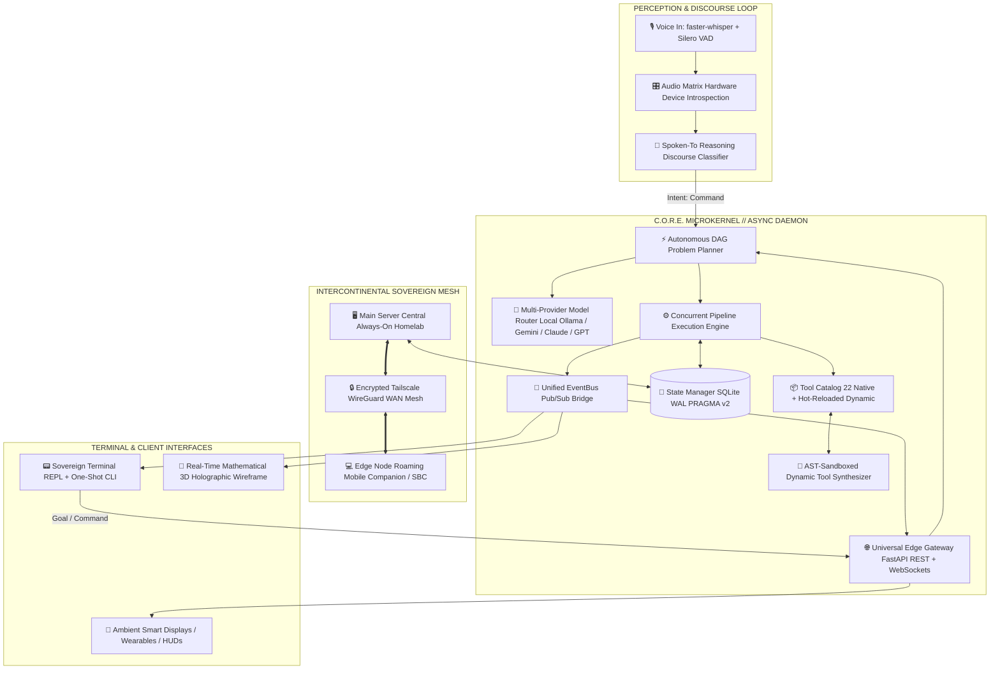

# C.O.R.E. AI :: SYSTEM RELEASE PROTOCOL
### KERNEL PROTOCOL v0.2.0-alpha // CODENAME: "PRECISION & FLOW"

```text
   ______ ____  ____  ______   ___    ____
  / ____// __ \/ __ \/ ____/  /   |  /  _/
 / /    / / / / /_/ / __/    / /| |  / /  
/ /___ / /_/ / _, _/ /___   / ___ |_/ /   
\____/ \____/_/ |_/_____/  /_/  |_/___/   

CONCURRENT OMNIPRESENT REASONING ENGINE // SOVEREIGN LIFE OS
```

| Kernel Version | Operational Status | Verification | Sovereign Ethos |
| :---: | :---: | :---: | :---: |
| **`v0.2.0-alpha`** | 🟢 **OPERATIONAL** | 🧪 **123 / 123 PASSED** | 🛡️ **#ANTISLOP** |

| Mesh Storage | Cryptography | Telemetry | License |
| :---: | :---: | :---: | :---: |
| **SECURE WAL-MODE** | **256-BIT SOVEREIGN** | **0.00% (ZERO)** | **AGPL-3.0** |


> [!IMPORTANT]
> **The Sovereign Commitment:**
> Core AI is not a commercial product, a cloud wrapper, or a corporate data siphon. It is a **Sovereign Local Life Operating System** designed to return absolute technological autonomy, compute efficiency, and cryptographic privacy to the individual operator.
> 
> *Lead Architect:* **Dyvorn** (*aka Vyrn / Refined*) • **Source:** [`github.com/Dyvorn/Core-AI`](https://github.com/Dyvorn/Core-AI)

---

## ⚡ C.O.R.E. DECODED

```text
[C] CONCURRENT   ──► Asynchronous DAG pipeline execution. Solves multiple dependent & parallel sub-tasks simultaneously.
[O] OMNIPRESENT  ──► Pervasive across living spaces, workstations, homelabs, vehicles & wearables without central cloud lock.
[R] REASONING    ──► High-order discourse discrimination, intentionality detection & dynamic multi-provider routing.
[E] ENGINE       ──► Self-healing microkernel, AST-sandboxed dynamic tool synthesis & sovereign local authority anchor.
```

---

## 🏛️ THE #ANTISLOP MANIFESTO

Technology must elevate humanity—not extract rent, hoard behavioral telemetry, or pump low-effort corporate cash grabs.

```text
├── 1. RADICAL ANTI-SLOP & ZERO TELEMETRY
│      No telemetry pingbacks. No corporate metrics SDKs. No targeted profiling.
│      Your thoughts, plans, files, voice streams, and spaces remain encrypted on your hardware.
│
├── 2. PLANETARY RESOURCE INTEGRITY
│      Industrial AI data centers burn massive electric grids and evaporate billions of liters
│      of potable drinking water for evaporative cooling.
│      Core AI terminates unnecessary cloud compute: deterministic heuristic pipelines solve
│      routine operations in <10ms with ZERO external inference calls.
│
├── 3. 100% CHARITY & NON-EXPLOITATION PLEDGE
│      Core AI will never monetize your home or life. If sponsorships or donations are ever
│      accepted, 100% of proceeds are routed directly to verified ecological and humanitarian
│      charities (potable water access, reforestation, and disaster relief).
│
└── 4. TERMINAL SUPREMACY & DECOUPLED CLIENTS
       Zero hardcoded web UI bloat inside the kernel. The core microkernel communicates strictly
       via fast ANSI terminals, a real-time 3D vector wireframe engine, and high-concurrency
       WebSocket streaming (/ws/events, /ws/logs, /ws/nodes/{id}). External HUDs and mobile
       displays connect as decoupled edge clients.
```

---

## 🛰️ SYSTEM ARCHITECTURE TOPOLOGY  (MADE WITH HELP OF AI)



---

## 📦 GENESIS FEATURE CAPABILITY MATRIX

### 1. Concurrent Autonomous DAG Pipeline Engine
```text
MODULE: brain/pipeline_engine.py & brain/planner.py
STATUS: PRODUCTION-HARDENED
```
* **Parallel Graph Traversal:** Breaks complex natural language requests into concurrent topological execution steps. Non-dependent steps execute simultaneously over `asyncio` worker pools.
* **Dynamic Variable Cascading:** Intermediate tool outputs map cleanly into downstream parameters using `{{steps.<id>.output.<field>}}` templates.
* **Jarvis Self-Healing Recovery:** If a step fails, Core AI diagnoses the underlying exception, calculates an autonomous remedy, re-plans the dependency graph, and continues execution seamlessly.
* **Deterministic Heuristic Instant Execution:** Bypasses LLM latency for frequent commands (hardware status, time, file operations, weather, calculations), completing jobs in **< 10ms**.

---

### 2. Sovereign Identity & Day-Zero Blank Slate
```text
MODULE: interfaces/cli/setup_wizard.py & core/state.py
STATUS: ABSOLUTE PRIVACY ISOLATION
```
* **Zero Pre-Baked Identities:** The repository ships completely clean. No default usernames, accounts, personal directories, or pre-seeded database rows exist in Git.
* **First-Run Wizard:** Automatically launches upon initial startup if an unconfigured database is detected. Prompts for:
  1. Operator Call Sign & Aliases
  2. Primary Physical Space (Office, Sanctuary, Studio, Lab)
  3. Persona & Communication Tone (Tactical Direct, Friendly Concise, Casual)
  4. Local vs. Cloud Model Backends
* **256-Bit Cryptographic Sovereign Secret:** Automatically generates a high-entropy auth secret saved to local `config/.env` for authenticating remote nodes into the `OWNER` tier.
* **Factory Reset Command:** `core reset` or `core account reset` wipes all dynamic spaces, enrolled devices, and profiles back to Day-Zero with zero lingering artifacts.

---

### 3. Intercontinental Sovereign Mesh & Zero-Friction Enrollment
```text
MODULE: core/mesh_client.py & interfaces/install/enroll.py
STATUS: WAN OPERATIONAL
```
* **Decentralized Role Architecture:**
  - **`main_server`**: The always-on host holding the primary database, active DAG scheduler, and edge registry.
  - **`edge_node`**: Roaming laptop, smartphone, or vehicle unit that proxies goals to the main server when connected, or falls back to autonomous local heuristic planning when offline.
* **State Bundle Portability:** Instant machine migration with atomic export and import:
  ```bash
  core "mesh export"   # Packs SQLite state, topology & profile into encrypted bundle
  core "mesh import bundle.json" # Restores onto a brand new machine in seconds
  ```
* **Zero-Friction Device Onboarding:**
  ```bash
  python -m interfaces.install.enroll --server http://core-host:8000 --secret "YOUR_SECRET"
  ```

---

### 4. Ambient Neural Perception & Spoken-To Awareness
```text
MODULE: brain/spoken_to.py, engines/voice_in.py, & core/gateway.py
STATUS: LOW-LATENCY NEURAL AUDIO & DISCOURSE REASONING
```
* **Hardware Sample Rate Auto-Detection & Resampling:** Dynamically discovers native device rates (WASAPI / DirectSound 44.1kHz or 48kHz audio interfaces), completely resolving `PaErrorCode -9997 (Invalid sample rate)`. Integrates zero-dependency fast linear interpolation downsampling directly to Whisper's 16kHz stream.
* **Dynamic Noise-Floor Adaptive RMS VAD:** Continuous moving ambient baseline estimation (`self.ambient_noise_floor`) with dynamic threshold calculation (`adaptive_threshold = max(0.008, ambient_noise_floor * 2.2)`). Effortlessly triggers on quiet headsets while preventing runaway recordings in noisy rooms.
* **Pre-Roll Audio Ring Buffer:** Circular ~400ms buffer prepended upon voice activity detection so onset syllables ("Hey...", "Core...") are never clipped.
* **Resilient Model Cascade Fallback:** Automatically cascades down model tiers (`distil-large-v3` $\to$ `small` $\to$ `base` $\to$ `tiny`) if VRAM allocation or memory pressure occurs.
* **Four-Role Discourse Pragmatics Engine:** Core AI understands natural social context before speaking:
  - `ADDRESSED` ── Operator commands Core AI or gives natural room imperatives (reminders, git, notes, ram) ──► **Executes Pipeline**
  - `DEMONSTRATED` ── Operator showcases Core AI to guests/friends ──► **Chimes In Autonomously**
  - `REFERENCED` ── Operator talks *about* Core AI in 3rd person / past tense ──► **Stays Politely Silent**
  - `BYSTANDER` ── Ambient background conversation between humans ──► **Completely Ignored**
* **Wake-Word-Free Directives & Filler Stripping:** Seamlessly recognizes room imperatives (`"erinnere mich in 5 Min..."`, `"watch ram"`, `"git status"`) and cleanly peels conversational particles (`"Core, bitte zeig mir den git status"` $\to$ `"git status"`).
* **REST Discourse Endpoint:** External edge satellites and displays can evaluate discourse intention via `POST /api/v1/voice/spoken_to`.
* **Neural TTS Matrix:** Crystal-clear speech synthesis using Edge Neural TTS with offline `pyttsx3` fallback.
* **Spatial Audio Matrix:** Dynamic ALSA/WASAPI hardware device discovery binding zone locations to dedicated multi-channel soundcards with automatic spatial room handoff.

---

### 5. Terminal-Native 3D Holographic Rendering Engine
```text
MODULE: core/animation.py
STATUS: REAL-TIME WIREFRAME ENGINE
```
* **Floating-Point Mathematical Projection:** Complete 3D vector graphics calculated using real-time rotation matrices and depth-sorted floating-point Z-buffering in pure Python terminal space.
* **3 Geometric Topological Models:**
  1. *Quantum Gyroscopic Core* — Nested rotating multi-axis orbital rings with pulse nodes.
  2. *4D Hypercube (Tesseract)* — 8-cell 4D-to-3D-to-2D geometric stereographic projection.
  3. *Hexagonal Sovereign Monolith* — Faceted crystalline power core.
* **5 TrueColor Palette Themes:** Cyber Cyan, Sovereign Void, Matrix Emerald, Solar Flare, and Hyper Steel.
* **Interactive Live Keyboard Navigation:** Real-time camera orbital rotation (`WASD`), model switching (`M`), theme cycling (`T`), and animation pause (`Space`).

---

### 6. 24/7 Headless Daemon & Daily Driver CLI
```text
MODULE: core/service.py, core.bat, core.sh
STATUS: INSTANT DISPATCH (<100ms)
```
* **Operating System Native Service:** Pure `kernel32.OpenProcess` Win32 and POSIX process control without flaky subprocess wrappers.
* **Lifecycle Management:**
  ```bash
  core start     # Spawns 24/7 headless background server
  core status    # Displays live ANSI status card with PID, memory, and gateway state
  core stop      # Gracefully shuts down server, freeing GPU VRAM and system RAM
  ```
* **Instant One-Shot Command Dispatch:** Direct execution from any terminal without entering the interactive shell:
  ```bash
  core "what time is it"
  core "open discord and check system status"
  ```

---

## 💻 INTERACTIVE TERMINAL EXPERIENCE (PREVIEW)

```text
+=====================================================================+
|   CORE AI :: DAEMON & GATEWAY STATUS CARD                           |
+=====================================================================+
|   Daemon Process:   ONLINE (PID 12116)                              |
|   Universal Gateway:ONLINE (http://localhost:8000)                  |
|   Active Operator:  Dyvorn                                          |
|   Active Model:     gemini/gemini-2.5-flash                         |
|   Connected Nodes:  0                                               |
+=====================================================================+

Core [Dyvorn@office] > solve check system status and get time
[*] Decomposing goal with Planner: 'check system status and get time'
[+] Synthesized Pipeline DAG: 2 steps (ID: 41716bcb)
    - Step 's1': Get Time -> tool 'get_time' (independent)
    - Step 's2': Hardware Metrics -> tool 'get_hardware_metrics' (independent)

[*] Executing pipeline concurrently...
[OK] Pipeline Succeeded in 0.31s!

Core AI: System operating at optimal capacity. CPU is at 8.2%, memory at 41%, and the local time is 18:11.
```

---

## 🔒 SECURITY & ACCESS MATRIX

Core AI enforces three strict trust boundaries across all network connections:

```text
┌─────────────────┬─────────────────────────────────────────────────┬───────────────────────────────┐
│ TRUST TIER      │ CAPABILITIES & PRIVILEGES                       │ ENROLLMENT REQUIREMENT        │
├─────────────────┼─────────────────────────────────────────────────┼───────────────────────────────┤
│ 👑 OWNER        │ Full DAG Execution, Shell Command Tooling,     │ Cryptographic 256-Bit         │
│                 │ Process Termination, AST Tool Generation,       │ CORE_AUTH_SECRET Handshake    │
│                 │ State Migration, Mesh Relocation                │                               │
├─────────────────┼─────────────────────────────────────────────────┼───────────────────────────────┤
│ 🛰️ AMBIENT      │ Room Telemetry Ingestion, Spatial Audio Route   │ Pre-Enrolled Fixed Device     │
│                 │ Relocation, HUD Card Notification Broadcasts    │ Session Token                 │
├─────────────────┼─────────────────────────────────────────────────┼───────────────────────────────┤
│ 👤 GUEST        │ Restricted Querying, Mathematical Calculations, │ Public Gateway Endpoint       │
│                 │ Public Weather, General Knowledge Lookups       │ (Zero Credentials Required)   │
└─────────────────┴─────────────────────────────────────────────────┴───────────────────────────────┘
```

---

## ⚡ 60-SECOND QUICKSTART

### Windows (Automated One-Liner)
```powershell
irm https://raw.githubusercontent.com/Dyvorn/Core-AI/master/install.ps1 | iex
```

### Linux / macOS (Automated One-Liner)
```bash
curl -fsSL https://raw.githubusercontent.com/Dyvorn/Core-AI/master/install.sh | bash
```

### Manual Installation
```bash
# 1. Clone repository
git clone https://github.com/Dyvorn/Core-AI.git
cd Core-AI

# 2. Initialize virtual environment
python -m venv .venv

# 3. Install verified dependencies
# Windows:
.venv\Scripts\pip install -r requirements.txt
# Linux/macOS:
.venv/bin/pip install -r requirements.txt

# 4. Launch Core AI
# Windows:
.\core.bat
# Linux/macOS:
./core.sh
```

---

## 🛠️ CLI CHEAT SHEET

```text
CORE AI :: COMMAND REFERENCE
Usage: core <command> or core "<goal>"

LIFECYCLE:
  core                Launch interactive sovereign terminal shell
  core run            Launch interactive sovereign terminal shell
  core start          Spawn 24/7 background headless server daemon
  core stop           Gracefully terminate background daemon & free GPU/RAM
  core restart        Restart background server daemon
  core status         Inspect running server status card, PID, and health
  core account        Inspect Sovereign Operator Account identity matrix
  core account setup  Launch interactive wizard to update profile/models
  core reset          Factory reset database and account back to Day-Zero
  core logo / anim    Launch real-time 3D Sovereign Holographic visualizer
  core backup         Create instant atomic snapshot of database & config
  core update         Self-update from GitHub with state backup & test guard
  core test           Execute full automated pytest test suite (118 tests)
  core uninstall      Clean zero-residue system uninstallation

DAILY DRIVER & PROACTIVE HELPERS:
  core "<goal>"       Execute one-shot task directly (sub-50ms dispatch)
  core "remind me in 10m to <text>"  Schedule autonomous countdown reminder
  core "list reminders"              Inspect active reminders & proactive rules
  core "cancel reminder <text>"      Cancel reminder with fuzzy matching
  core "watch my ram"                Spawn proactive hardware vitals supervisor
  core "git status"                  Instant git branch, cleanliness & commit audit
  core "save note <title>: <body >"  Save persistent operator scratch note
  core "my notes"                    List saved scratch notes
```

---

## 🌟 ALPHA 0.2 HIGHLIGHTS: "PRECISION & FLOW"

### 1. Instant-Dispatch Fast CLI (`interfaces/cli/client.py`)
- **<50ms Execution**: Bypasses heavy Python ML/web startup delays by streaming tasks directly to the 24/7 background daemon over loopback.
- **Windows IPv6 Loopback Bypass**: Replaced `localhost` with `127.0.0.1` to eliminate 2.2-second DNS resolve latencies.
- **Zero Terminal Noise**: Clean ANSI output without database mounting or logger chatter.

### 2. Proactive Autonomous Agency & Countdown Timers
- **Autonomous Countdown Engine**: The background `ProactiveDaemon` evaluates countdown triggers in real-time, announces them via neural TTS / ambient HUD cards, and automatically marks one-shot rules inactive.
- **Hardware Supervisors**: Background rules actively monitor host RAM and CPU load, warning the operator if thresholds are breached.
- **Fuzzy Cancellation**: Cancel reminders naturally (`core "cancel reminder meeting"`) using forgiving SQL substring queries.

### 3. Developer Daily Driver & Scratch Memory
- **Git Repo Telemetry**: Zero-latency git status, diff stats, branch identification, and commit inspection.
- **Persistent Notes**: Key-value operator notes persisted across reboots in SQLite WAL.
- **System Clipboard**: Native OS clipboard reading and writing on Windows, macOS, and Linux.

### 4. Zero-Delay Terminal Launch
- Interactive terminal REPL boots in <5ms by defaulting animation to skipped.

---

## 🧪 VERIFICATION & TEST CERTIFICATION

```text
============================= test session starts =============================
platform win32 -- Python 3.13.10, pytest-9.1.1, pluggy-1.6.0
collected 118 items

tests/test_account.py .................................... [  3%]
tests/test_animation.py .................................. [  6%]
tests/test_bus.py ........................................ [  7%]
tests/test_daily_driver.py ............................... [ 11%]
tests/test_desktop_and_os_tools.py ....................... [ 14%]
tests/test_dynamic_generator.py .......................... [ 18%]
tests/test_fast_cli.py ................................... [ 21%]
tests/test_fix_release_v011.py ........................... [ 25%]
tests/test_gateway.py .................................... [ 32%]
tests/test_logging.py .................................... [ 33%]
tests/test_mesh_client.py ................................ [ 38%]
tests/test_model_router.py ............................... [ 43%]
tests/test_network_and_templates.py ...................... [ 46%]
tests/test_pipeline_engine.py ............................ [ 48%]
tests/test_planner.py .................................... [ 56%]
tests/test_proactive.py .................................. [ 57%]
tests/test_proactive_and_dev_tools.py .................... [ 62%]
tests/test_registry.py ................................... [ 64%]
tests/test_remote_dispatcher.py .......................... [ 66%]
tests/test_safety.py ..................................... [ 67%]
tests/test_server_upgrades.py ............................ [ 72%]
tests/test_service_and_updater.py ........................ [ 81%]
tests/test_settings_and_dashboard.py ..................... [ 83%]
tests/test_spatial_audio.py .............................. [ 87%]
tests/test_spoken_to.py .................................. [ 94%]
tests/test_voice_pipeline.py ............................. [100%]

============================= 118 passed in 108.57s ============================
```
* **Test Suite Status:** `100% PASSING (118/118)`
* **Code Smells & Debt:** `0 BLOCKERS`
* **Zero Corporate Telemetry Audit:** `VERIFIED CLEAN`
* **#ANTISLOP Compliance:** `100% CLEAN (MOCK TOYS ERADICATED)`

---

## 👤 STEWARDSHIP & CREDITS

* **Lead Architect & Creator:** **Dyvorn** (*aka Vyrn / Refined*) — [@Dyvorn](https://github.com/Dyvorn)
* **Project Repository:** [`https://github.com/Dyvorn/Core-AI`](https://github.com/Dyvorn/Core-AI)
* **License:** GNU Affero General Public License v3.0 ([AGPL-3.0-only](LICENSE))

```text
[ C.O.R.E. AI ── SOVEREIGN COMPUTING REDEFINED ── WELCOME TO GENESIS ]
```
