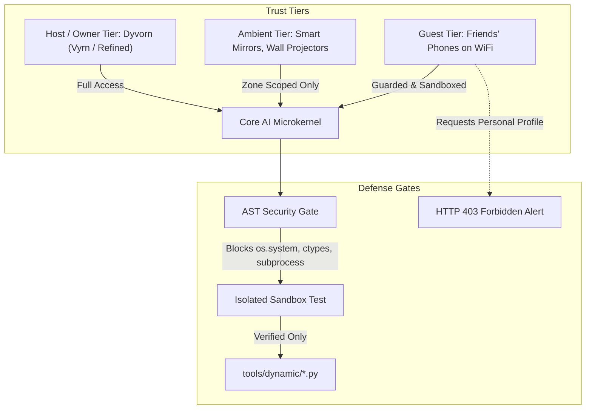

# Security Policy: Core AI Sovereign Life OS

Core AI is designed from the ground up as a **sovereign, local-first, privacy-defending personal operating system**. Security and privacy are not afterthought add-ons; they are core architectural invariants.

---

## 1. Security Architecture & Threat Model

Core AI operates in untrusted and semi-trusted network environments (home LANs, mobile hotspots, Bluetooth mesh, Tailscale networks). To protect the user's personal sovereignty, data, and physical surroundings, the system enforces the following boundaries:

### Trust Tier Definitions
1. **Host / Owner Tier (`OWNER`)**:
   - Authorized personal hardware (personal laptop, phone, studio workstation).
   - Authenticated via secret handshake tokens or mutual TLS.
   - Has full read/write access to user profile memory, personal preferences, sensitive files, and all tool execution pipelines across all zones.
2. **Ambient Displays & Room Nodes (`AMBIENT`)**:
   - Hardware permanently stationed in specific rooms (Smart Mirrors, Wall Projectors, Room Mics).
   - Scoped strictly to their designated zone.
   - Can display HUD glance cards, stream room audio, and report environmental sensors.
   - **Cannot** dump private user identity memory or access cross-zone credentials.
3. **Guest & Untrusted Devices (`GUEST`)**:
   - Unauthenticated hardware on the local network (e.g. a friend's phone connecting to WiFi, guest laptops).
   - Requests to query personal user identity, access memory, or trigger tools without explicit owner consent are rejected immediately with `HTTP 403 Forbidden`.
   - Core AI alerts the owner when an unknown device attempts to interact.

---

## 2. Dynamic Tool Synthesis Sandbox
When Core AI synthesizes a new tool on the fly to bridge a capability gap:
1. **Static AST Analysis**: Before code is ever loaded into Python, [brain/dynamic_generator.py](file:///g:/VSC_Projects/Core%20AI/brain/dynamic_generator.py) inspects the Abstract Syntax Tree. Any attempt to import prohibited modules (`subprocess`, `shutil`, `ctypes`, `socket`, `pty`, `multiprocessing`) or execute arbitrary reflection (`eval`, `exec`, `__import__`) is rejected.
2. **Ephemeral Sandbox Execution**: The tool is executed in an isolated local dictionary scope with test parameters.
3. **Atomic Persistence**: Only after the sandbox execution succeeds is the tool written to `tools/dynamic/` and hot-loaded into the runtime.

---

## 3. Supported Versions

| Version | Supported          |
| ------- | ------------------ |
| 2.0.x   | :white_check_mark: |
| 1.0.x   | :x:                |

---

## 4. Reporting a Security Vulnerability

Because Core AI is an autonomous agent operating physical peripherals (doors, lights, cameras, audio), security issues are taken with extreme priority:

- **Private Disclosure**: If you discover a vulnerability, do **not** open a public issue.
- **Reporting Channel**: Submit a private security report to the repository owner or open a confidential GitHub Security Advisory.
- **Response Timeline**: Acknowledgment within 24 hours, patch deployment within 72 hours.
