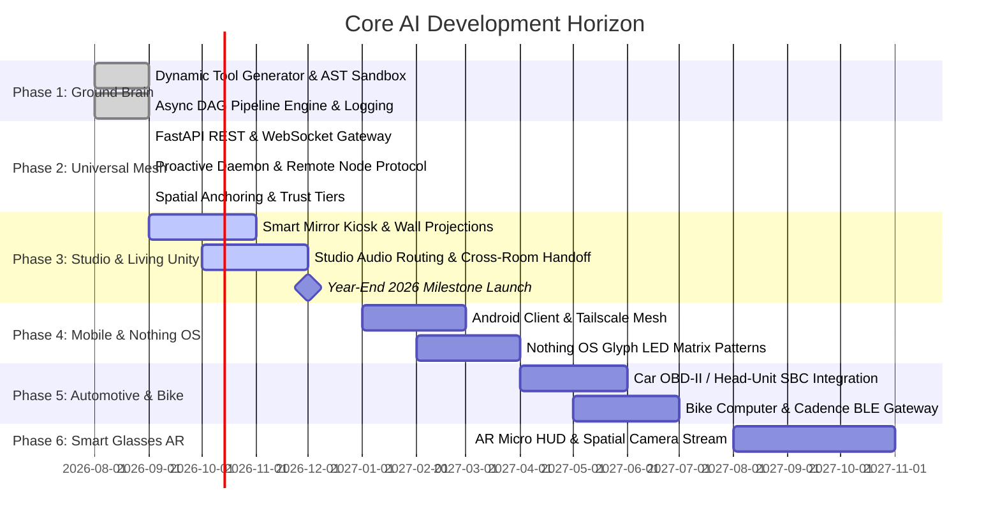

# Core AI Master Architectural Roadmap (2026 – 2028)

Core AI is an autonomous, open-source, sovereign personal companion and pervasive life operating system. This document outlines the technical milestones from the initial ground engine to full physical ubiquity across the home, studio, vehicles, mobile devices, and AR wearables.

---

## Roadmap Timeline at a Glance

---

## Detailed Milestone Breakdown

### Phase 1: Ground Microkernel & Dynamic Brain `[COMPLETED — SEP 2026]`
- **Tool Catalog & Introspection**: System-wide JSON schema generation for native and dynamic tools.
- **Dynamic Tool Synthesis & Sandbox**: AST analysis preventing dangerous calls (`subprocess`, `ctypes`), sandbox execution test, and disk persistence to `tools/dynamic/` with zero-restart hot-reloading.
- **Concurrent DAG Pipeline Engine**: Parallel step scheduling ("multiple things at once"), dynamic variable resolution (`{{steps.A.output.B}}`), and Jarvis-like failure diagnosis.
- **Multi-Sink Logging**: High-contrast console, rotating file logger, JSONL audit trail, and SQLite execution history.

### Phase 2: Universal Edge Gateway & Spatial Anchoring `[COMPLETED — SEP 2026]`
- **Universal Gateway**: FastAPI REST API and bidirectional WebSocket streams (`/ws/events`, `/ws/nodes/{id}`) with auto-generated OpenAPI documentation.
- **Proactive Reasoning Daemon**: Background condition-action watcher evaluating state changes and dispatching proactive pipelines and alerts.
- **Remote Edge Node Protocol**: Transparent network dispatching of tool executions to external edge nodes (car, phone, glasses).
- **Personal Identity Memory**: Persistent `user_profiles` database tracking the operator's preferred name, aliases, pronouns, and persona style, configured via first-run setup or dynamically via natural language.
- **Spatial Device Topology**: Distinguishes fixed spatial anchors (microphones, smart mirrors) from roaming devices (laptops, phones), supporting proximity and verbal anchoring.
- **Security & Trust Tiers**: Enforces `OWNER`, `AMBIENT`, and `GUEST` permission levels, defending private user memory with `HTTP 403` rejections.
- **Zero-Friction 1-Line Onboarding**: `interfaces/install/enroll.py` for enrolling any new laptop, SBC, or Arduino bridge in a single command.

### Phase 3: Multi-Zone Workspace & Living Sanctuary Unity (Year-End 2026 Target) `[COMPLETED]`
- **Objective**: Create a seamless over-watching harness uniting the primary workspace/studio and personal living sanctuary with zero hardcoding.
- **Deliverables**:
  - **Dynamic Spatial Audio Routing Engine (`engines/audio_router.py`)**: Runtime audio device introspection and zone-to-soundcard binding with fallback defaults.
  - **Cross-Zone Spatial Handoff Engine (`brain/spatial_handoff.py`)**: Automatic re-targeting of microphones and speakers, ambient HUD card dispatching, and dynamic zone scene triggering (`SpatialHandoffEvent`).
  - **Smart Mirror & Wall Projection Kiosk Launcher (`interfaces/mirror/launcher.py`)**: Cross-platform watchdog launcher for Chromium/Chrome/Edge in fullscreen kiosk mode.
  - **Gateway Spatial Audio Endpoints (`/api/v1/audio/*`, `/api/v1/spatial/handoff`)**: REST and WebSocket controls for spatial routing and transitions.
  - **Native Tool Integration**: `route_spatial_audio` registered in ToolRegistry for autonomous planner execution.

### Phase 4: Mobile Companion & Nothing OS Integration `[Q1 2027]`
- **Objective**: Extend Core AI to your daily driver mobile device.
- **Deliverables**:
  - **Mobile Companion App**: Cross-platform client connecting via Tailscale or local WebSocket.
  - **Nothing OS Glyph Matrix**: Dedicated patterns for the rear Glyph LEDs (subtle pulsing while Core AI is reasoning, quiet flash on action completion, discreet security warnings).
  - **Quick Tiles & Ambient Lock-Screen Widgets**: Instant 1-tap voice access and glanceable status updates.
  - **Mobile Peripheral Bridge**: Phone acts as the cellular gateway bridging BLE sensors from smart glasses and bicycle computers.

### Phase 5: Automotive & Bicycle SBC Integration `[Q2 2027]`
- **Objective**: Bring Core AI into your commute and travel.
- **Deliverables**:
  - **Car SBC (Raspberry Pi / Orange Pi)**: Embedded Linux unit with CAN-bus / OBD-II connection for live speed, fuel/battery, and engine diagnostics.
  - **Proactive Vehicle Assistant**: *"You're driving to work and the studio window was left open, but don't worry, I closed it for you."*
  - **Bike Computer**: Lightweight GPS route assistance, cadence sensors, and handlebar button integration.

### Phase 6: Smart Glasses AR & Spatial Perception `[Q3 2027]`
- **Objective**: Hands-free ambient overlay.
- **Deliverables**:
  - **Micro-HUD Card Renderer**: Ultra-compact 3-word glance prompts projected on smart glasses displays.
  - **Bone-Conduction Voice Dispatch**: Low-latency whisper responses directly into the ear.
  - **Spatial Camera Stream**: Computer vision tool integration for object recognition in the user's field of view.

---

## Anti-Slop & Truthful Capability Standard
Core AI strictly rejects vaporware and false claims:
1. Every capability listed as `[COMPLETED]` is backed by automated tests in `tests/`.
2. Every tool reports its exact execution status, timing, and failure diagnosis.
3. The system never pretends to accomplish physical or computational tasks it cannot verify.
